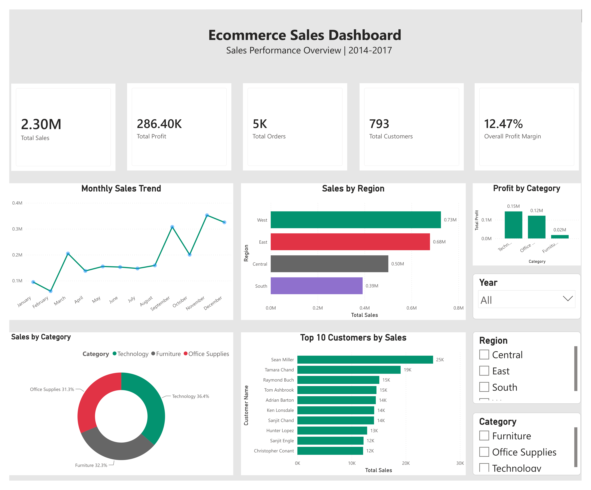
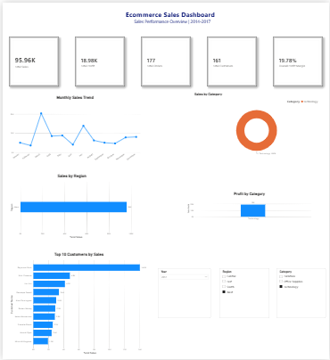

# 📊 Ecommerce Sales Analysis

## 📌 Overview

This project analyzes an e-commerce sales dataset using **Python**, **MySQL**, and **Power BI** to uncover valuable business insights and build an interactive sales dashboard.

The project demonstrates a complete data analytics workflow, including data cleaning, exploratory data analysis (EDA), SQL-based business analysis, and dashboard creation for decision-making.

---

## 🛠️ Tech Stack

- Python
- Pandas
- NumPy
- Matplotlib
- MySQL
- Power BI

---

## 📂 Project Workflow

1. Data Exploration
2. Data Cleaning & Preprocessing
3. Exploratory Data Analysis (EDA)
4. SQL Business Analysis
5. Interactive Power BI Dashboard

---

## 📈 Key Insights

- Technology generated the highest sales.
- Technology recorded the highest profit margin.
- West region generated the highest revenue.
- California recorded the highest sales among all states.
- Sean Miller was the highest revenue-generating customer.
- Canon imageCLASS 2200 Advanced Copier was the best-selling product.
- Higher discounts generally reduced overall profitability.

---

## 📊 Dashboard Features

- KPI Cards
  - Total Sales
  - Total Profit
  - Total Orders
  - Total Customers
  - Overall Profit Margin
- Monthly Sales Trend
- Sales by Category
- Sales by Region
- Profit by Category
- Top 10 Customers by Sales
- Interactive Slicers (Year, Region, Category)

---

## 🖼️ Dashboard Preview

### Dashboard Overview



### Dashboard with Filters Applied



---

## 💼 Business Outcomes

- Identified the highest revenue-generating product category.
- Analyzed monthly sales and profit trends to understand business performance.
- Compared sales performance across different regions.
- Identified top-performing customers and products.
- Evaluated the impact of discounts on profitability.
- Built an interactive Power BI dashboard to support business decision-making.

---

## 📁 Folder Structure

```text
Ecommerce-Sales-Analysis/
│
├── data/
│   ├── raw/
│   └── cleaned/
│
├── python/
│
├── sql/
│
├── powerbi/
│
├── dashboard_images/
│
├── README.md
├── requirements.txt
└── .gitignore
```

---

## 🚀 How to Run the Project

1. Clone the repository.
2. Install the required Python libraries:

```bash
pip install -r requirements.txt
```

3. Run the Python scripts in the following order:

- 01_data_exploration.py
- 02_data_cleaning.py
- 03_eda.py
- 04_sql_export.py

4. Execute the SQL scripts in MySQL.
5. Open `Ecommerce_Sales_Dashboard.pbix` in Power BI Desktop to explore the interactive dashboard.

---

## 👤 Author

**Nihal Mansuri**

---

## ⭐ If you found this project useful, consider giving it a star!
